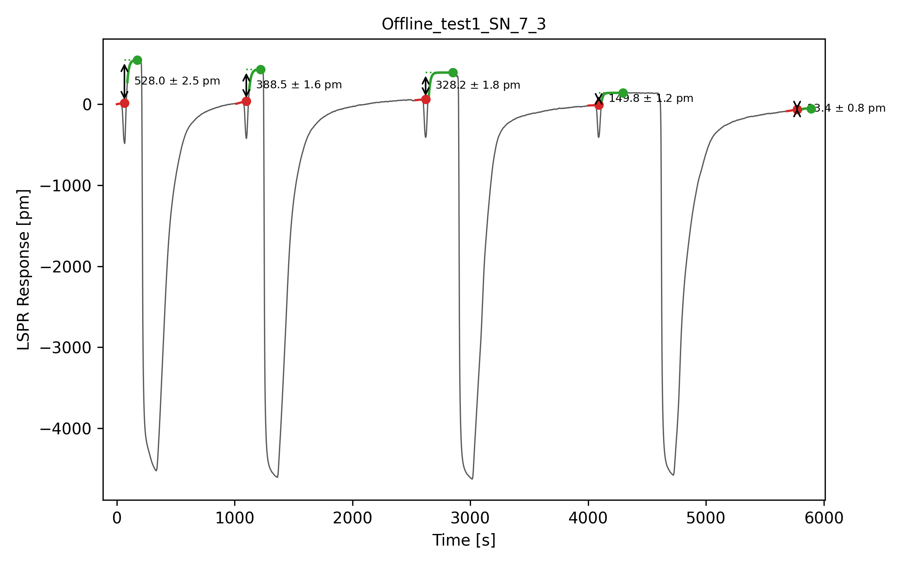

# Peak Height

Measures equilibrium step responses in LSPR sensorgrams, with an uncertainty on
every value.

## The measurement

In a localised surface plasmon resonance (LSPR) protein quantification unit, each
sample is read out by a deliberate **shift in the light incidence**: the response
drops sharply for a few tens of seconds, then relaxes to a new equilibrium level.
The difference between the level before the shift and the level it settles at
afterwards is what associates a sample with its product concentration. Each
read-out is followed by a regeneration step, so a record is a repeating cycle of
*switch → relaxation → regeneration*, with one measurement per cycle.

The task is therefore not peak detection but estimation of an equilibrium level
change across a switching event, in the presence of baseline drift, at an unknown
number of unknown times.



*Record `Offline_test1_SN_7_3`. Each cycle shows the narrow switch transient, the
pre-switch level extrapolated to the switch time (red), the fitted relaxation and
its asymptote (green), and the step between them with its standard uncertainty.
The deep excursions between cycles are regeneration. The last event, 13.4 pm
against steps of 150–530 pm, is a tail artefact that the defaults keep because it
is statistically real; `--min-step` removes it.*

## Method

Detection runs on a smoothed copy of the signal; **all estimation uses the raw
samples**.

**Locating the switch.** Transients are local minima selected by *prominence*,
which in one dimension equals topological persistence [2] — scale-free, and
unreachable by noise. The gate is $10\sigma$, where $\sigma =
1.4826\,\mathrm{MAD}(\Delta y)/\sqrt{2}$ estimates the noise from the first
differences; this estimator has a 50 % breakdown point [3], so the large
regeneration excursions cannot inflate it. Smoothing uses a Gaussian of scale
specified in seconds — the unique kernel introducing no new extrema as scale
grows [1], so it can suppress structure but never invent a transient.

**Segmenting.** Regeneration excursions are told from switch transients by
**depth**, not duration: they are thousands of picometres deep against a few
hundred, while their durations overlap once an excursion is clipped by the end of
a record. They partition the record into cycles, so the number of reported values
is fixed by the record's structure, not by a threshold.

**Estimating.** The pre-switch level $\hat{y}_-$ is an OLS straight line fitted
to the approach and evaluated at the switch time $t_0$, the linear term absorbing
the drift. The post-switch level is the asymptote of a first-order relaxation

$$y(t) = A + C\exp\!\left(-\frac{t-t_0}{\tau}\right),$$

fitted past a guard band out to the plateau maximum; the measurement is $\Delta =
A - \hat{y}_-$. For fixed $\tau$ the model is linear in $(A,C)$, so $\tau$ is
profiled on a geometric grid and the linear part solved exactly — separable least
squares [4], needing no initial guess and unable to fail to converge. Using the
fitted asymptote rather than the response at a fixed delay is what removes the
drift bias, since the plateaus creep.

**Uncertainty.** The relaxation carries the Gauss–Newton covariance over all of
$(A,C,\tau)$, so profiling does not make $u(A)$ optimistic. The two fits being
independent, $u(\Delta) = \sqrt{u^2(\hat{y}_-) + u^2(A)}$, with a 95 % interval
from the Student-$t$ quantile at Welch–Satterthwaite effective degrees of freedom
[5].

**Rejection.** An event is reported only if $\tau$ falls strictly inside the
search range, both windows hold enough samples, and $|\Delta|$ exceeds both
$5\sigma$ and 5 standard uncertainties. Rejections are printed with their reason.
Significance cannot separate a small *real* step from a small *uninteresting* one
— that needs knowledge of the instrument, and is the one place a prior enters,
through the off-by-default `--min-step`.

## Usage

Needs `numpy`, `scipy` and `matplotlib`.

```bash
python measure_step_response.py                       # ./data -> ./output
python measure_step_response.py --min-step 50         # ignore steps under 50 pm
```

Records are tab- or space-separated, one header line, columns *time*,
*response*, *extinction*; a comma decimal separator is accepted.

## Output

`output/csv` holds one row per measurement — `step_pm`, `u_pm`, the 95 %
interval, the fitted `tau_s`, and diagnostics. `output/plot_fit` draws the
fitted model over the data, and `output/plot_only` the bare sensorgram. The red
and green markers are the two **fitted levels**, not data points that happened to
be local extrema.

## Parameters

All in physical units, all with defaults; `--help` lists them.

| | | |
| --- | --- | --- |
| `--detect-sigma` | 3 s | detection scale; structure below it is noise |
| `--min-prominence` | 10 | transient prominence, in noise scales |
| `--switch-width` | 60 s | maximum width of a switch transient |
| `--cycle-depth` | 0.40 | excursion depth bounding a cycle, as a fraction of range |
| `--guard` | 25 s | excluded either side of the switch |
| `--pre-window` / `--post-window` | 60 / 250 s | fit window lengths |
| `--min-snr` / `--min-tstat` | 5 / 5 | significance floors |
| `--min-step` | 0 pm | absolute size floor; a stated prior, off by default |

## References

1. Babaud, Witkin, Baudin & Duda. *Uniqueness of the Gaussian kernel for
   scale-space filtering.* IEEE TPAMI **8**(1), 26–33 (1986).
2. Edelsbrunner, Letscher & Zomorodian. *Topological persistence and
   simplification.* Discrete Comput. Geom. **28**, 511–533 (2002).
3. Rousseeuw & Croux. *Alternatives to the median absolute deviation.* JASA
   **88**(424), 1273–1283 (1993).
4. Golub & Pereyra. *The differentiation of pseudo-inverses and nonlinear least
   squares problems whose variables separate.* SIAM J. Numer. Anal. **10**(2),
   413–432 (1973).
5. JCGM 100:2008. *Guide to the expression of uncertainty in measurement (GUM)*,
   Annex G.

## Final note

Written in 2022 for a fellow student's master's work and reworked around the
estimator above. Suggestions welcome via
[LinkedIn](https://www.linkedin.com/in/raphael-mauron/).
